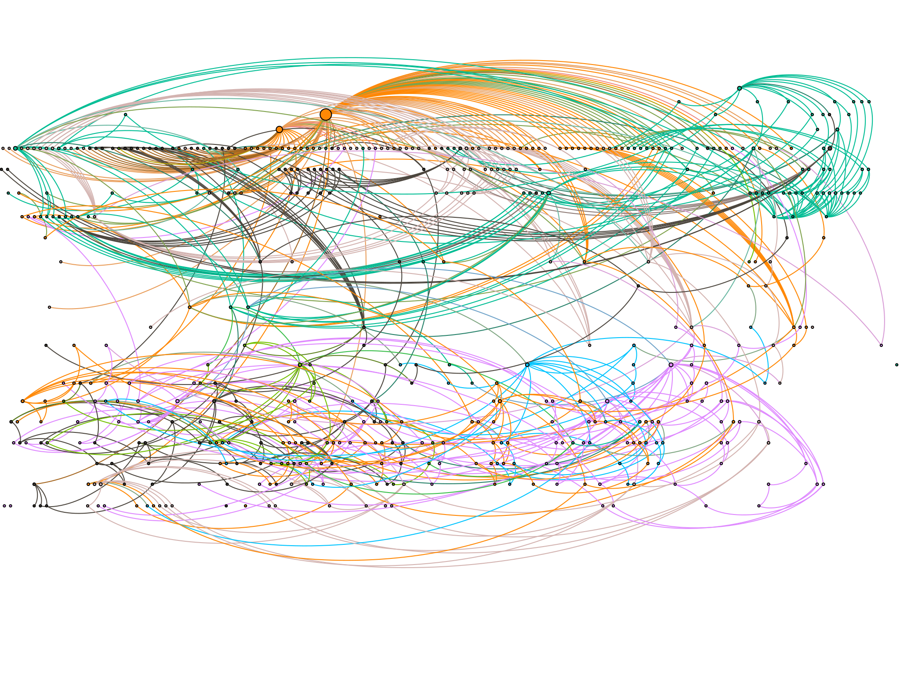

## Scaling Python with Dask


Jim Crist

<hr width=40%>

*AnacondaCON, 4/3/19*

~~~

http://bit.ly/anacondacon-dask-2019

~~~

Materials can be found on github here:

https://github.com/jcrist/anacondacon-2019-tutorial

~===~

### Questions?


~===~

## Extra Materials...

~===~

## Common Use Cases

~~~

## Large Pandas Dataframes

- Handles both out-of-core and distributed dataframes
- Can handle 10s of GB -> TB of data, depending on workflow
- Accounts for ~1/3 of our users (estimate)

~~~

## Large Distributed Arrays

- Many problems fit this model (Images, Geoscience data, etc...)
- Oldest, most complete/performant part of Dask
- Often just a drop-in for NumPy arrays

~~~

## Large Scale ML

- `dask_ml`: a Scikit-Learn like ML library
- Both model and data parallel algorithms
- Parallelize Custom ML workflows with `dask.delayed`


~~~

## Large Scale Geoscience

- Used inside of [Xarray](http://xarray.pydata.org/en/stable/) and [Iris](https://scitools.org.uk/iris/docs/latest/)
- Early adopter of Dask, large established codebase


~~~

## Large Scale Geoscience

- 
[Pangeo](https://pangeo.io/): a community platform for Big Data geoscience
- Built on Xarray, Dask, and JupyterHub (on Kubernetes)
- Community effort involving several institutions (Anaconda included)

~~~

## ETL workflows

- Read parquet files from HDFS, do some transformations, write new parquet
  files to S3

```python
df = dd.read_parquet('hdfs:///accounts-*-2010.parquet')
...
df.to_parquet('s3://accounts-aggregated/2010/*.parquet')
```

~~~

## Complex Custom Computations



http://blog.dask.org/2018/02/09/credit-models-with-dask

~~~

## Used inside other libraries

- [Xarray](http://xarray.pydata.org/en/stable/)
- [Iris](https://scitools.org.uk/iris/docs/latest/)
- [Scikit-Learn](https://scikit-learn.org/) (through [joblib](https://joblib.readthedocs.io/en/latest/))
- [Scikit-Image](https://scikit-image.org/)
- [TPOT](http://epistasislab.github.io/tpot/)
- [Hyperspy](http://hyperspy.org/)
- [Prefect](https://www.prefect.io/)
- [dask-image](https://github.com/dask/dask-image)

~~~

## More Examples:

http://stories.dask.org/en/latest/

~===~

## Comparison To Other Systems

~~~

## Spark

- Spark is great
    - ETL + Database operations
    - SQL-like streaming
    - Spark 2.0 is decently fast
    - Integrate with Java infrastructure
- Dask is great
    - Tight integration with NumPy, Pandas, Toolz, Sklearn, ...
    - Ad-hoc parallelism for custom algorithms
    - Easy deployment on clusters or laptops
    - Complement the existing SciPy ecosystem (Dask is lean)
- Both are great
    - Similar network designs and scalability limits

~~~

## Ray

- Ray:
    - Originally focussed on ML algorithms
    - Eager computation model
    - Optimized for task throughput, thinks less about where to run tasks
    - No collections API, custom workflows are common
    - Supports AWS and GCP, as well as manual deployments
- Dask:
    - Originally focussed on parallel arrays
    - Supports both lazy and eager computation
    - Central scheduler, thinks hard about where/when to run tasks
    - High-level collections API, as well as low level features
    - Easy to deploy on multiple cluster managers
