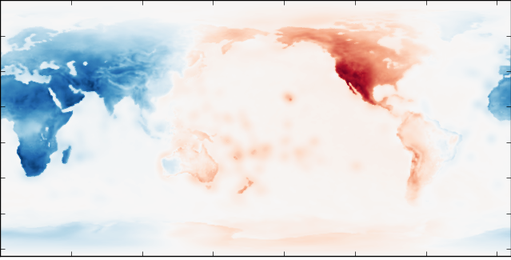

## Dask Overview and Internals


Jim Crist

<hr width=40%>

*Dask Summit, 2/7/19*

~~~

Materials can be found on github [here](https://github.com/jcrist/talks/tree/master/dask_summit)

~===~

### In the beginning...

- Scientific Python goes back to 1995, with Numeric


~~~

### Moore's Law

The number of transistors in a chip ~doubles every two years.

~~~

### Moore's Law


~~~

### Hard drives are getting cheaper


~~~

### As are large workstations

[Amazon EC2 Pricing](http://www.ec2instances.info/)

~===~

### Python has a fast and pragmatic data science ecosystem

---

### ... restricted to a single core :(

~~~

### Most Python programs


~~~

### The SciPy ecosystem

*  **NumPy**: arrays
*  **Pandas**: tables
*  **Scikit Learn**: machine learning
*  **Statsmodels**: statistics
*  ...
*  ...
*  **GeoPandas**: geo-spatial
*  **Scikit-Image**: image analysis
*  **Scikit-Bio**: ...

~~~

### How do we exploit these improvements

---

### ... without rewriting everything?

~===~


### a flexible library for parallelism

~===~

## Dask is:

- A parallel computing framework

- Written in pure Python

- That leverages the excellent Python ecosystem

- Using blocked algorithms and task scheduling

~~~

### Blocked Algorithms

**Blocked Mean**

```python
x = h5py.File('data.hdf5')['x']    # Trillion element array on disk

sums = []
counts = []
N = 1000000
for i in range(N):                  # One million times
    chunk = x[N*i: N*(i+1)]         # Pull out chunk
    sums.append(np.sum(chunk))      # Sum chunk
    counts.append(len(chunk))       # Count chunk

result = sum(sums) / sum(counts)    # Aggregate results
```

~~~

### Blocked Algorithms


~~~

### Task Graphs

- Represent inter-dependent computations as a *graph*
    * Specifically a *Directed Acyclic Graph* (DAG)


~~~

### Task Graphs

- Nodes are *tasks* in the graph
    * Rectangles represent data
    * Circles represent computation

- Edges are data dependencies


~~~

### Task Graphs

- DAGs have a *topological ordering*
    * Can be arranged such that for every edge `a->b`,  `a` comes before `b` in the ordering.

- Not necessarily unique
  
    * ``a, b, c, d`` 
    * ``a, b, d, c``


~~~

### Task Scheduling

- Scheduler takes in graphs and runs the specified tasks, often in parallel

- Task schedulers are common (Make, MapReduce, Spark, Airflow, etc...)


~~~

### Task Scheduling

- Scheduler takes in graphs and runs the specified tasks, often in parallel

- Task schedulers are common (Make, MapReduce, Spark, Airflow, etc...)


~===~

### Dask Stack


~~~

### Dask Stack


~~~

### Dask Stack


~~~

### Dask Stack


~~~

### Dask Stack


~===~

### Dask Array

- Parallel and out-of-core array library
- Mirrors NumPy interface
- Coordinate many NumPy arrays into single logical Dask array


~~~

### Example

http://examples.dask.org/array.html

~===~

### Dask Dataframe

- Parallel and out-of-core dataframe library
- Mirrors the Pandas interface
- Coordinates many Pandas DataFrames into single logical Dask DataFrame
- Index is (optionally) sorted, allowing for optimizations


~~~

### Example

http://examples.dask.org/dataframe.html

~===~

### Dask Bag

- Parallel collection of python objects
- Builds off `toolz`/`cytoolz`

```python
>>> import dask.bag as db
>>> import json

>>> records = db.read_text('path/to/data.*.json.gz').map(json.loads)

>>> records.filter(...).pluck('name').frequencies().topk(10, ...)
```

~===~

## Some problems don't fit well into collections

~~~

### Dask Delayed

- Tool for creating arbitrary task graphs
- Dead simple interface (one function)
- Plays well with existing code (with some caveats)


```python
# Wrap functions to make them lazy
delayed(function)(*args, **kwargs) -> Delayed

# Wrap data to make attribute access lazy
delayed(data) -> Delayed
```

~~~

### Dask Delayed

```python
_
```

---

```python
results = {}

for a in A:
    for b in B:
        results[a, b] = fit(a, b)

best = score(results)
_
```

~~~

### Dask Delayed

```python
from dask import delayed, compute
```

---

```python
results = {}

for a in A:
    for b in B:
        results[a, b] = delayed(fit)(a, b)

best = delayed(score)(results)
result = best.compute()
```

~===~

### Collections author task graphs

<hr>


<hr>

### Now we need to run them efficiently

~~~

### Dask schedulers target different architectures

---

### Easy swapping enables scaling up *and down*

~===~

### Single Machine Scheduler

- *Parallel CPU*: Uses multiple threads or processes

- *Minimizes RAM*: Choose tasks to remove intermediates

- *Low overhead:* ~100us per task

- *Concise*: ~600 LOC, mostly stable for ~2 years

~===~

### Distributed Scheduler

- *Distributed*: One scheduler coordinates many workers

- *Data Local*: Tries to moves computation to "best" worker

- *Asynchronous*: Continuous non-blocking conversation (using
  [Tornado](http://www.tornadoweb.org/en/stable/))

- *Extra Features*: Supports futures, streams, actors, etc...

- *Multi-user*: Several users can share the same system

- *Less Concise*: Separate, much larger codebase

~~~

## Example

~~~

### Distributed Scheduler


~~~

### Task Scheduling


    x = f(1)
    y = f(2)
    z = g(x, y)


~~~

### All decisions are done in-the-small (almost)


### All decisions are done in constant time (almost)

~~~

### Which function to run first?


~~~

### Prefer Tasks on Critical Path


~~~

### Which function to run first?


~~~

### Expose Parallelism


~~~

### Which function to run first?


~~~

### Release Data


~~~

### Release Data, Free Memory


~~~

### Two Workers


~~~

### Two Workers


~~~

### Two Workers


~~~

### Two Workers


~~~

### Two Workers


~~~

### Data Locality


~~~

### Data Locality


~~~

### Data Locality


~~~

### .


~~~

### Minimize Communication


~~~

### Balance Computation and Communication


~~~

### .


~~~

### Work Steal


~~~

### Work Steal


~~~

### Other Optimizations ...

- Scale up or down based on load
- Oversubscribe workers with many small tasks
- Spill unused data to disk
- Estimate task time/memory usage based on past examples
- Batch many-small-messages in 2ms windows

~===~

## Deployment

~~~

## Manual Setup

**Start Scheduler**

```bash
$ dask-scheduler
```

**Start Worker**

```bash
$ dask-worker <SCHEDULER-ADDRESS>
```

**Connect with Client**

```python
from dask.distributed import Client
client = Client('<SCHEDULER-ADDRESS>')
...
```

~~~

## Local Cluster

```python
from dask.distributed import Client

# As many workers as cores
client = Client()

# Use 8 worker processes
client = Client(n_workers=8)

# Use 2 worker processes, each with 4 threads
client = Client(n_workers=2, threads_per_worker=4)

# Use threads only (all threads local to *this* process)
client = Client(processes=False)
```

~~~

## Local Cluster

- Can start a Dask cluster locally on a single machine in one line

- Useful for local work

- Recommended over `multiprocessing` scheduler
    - More efficient
    - More features
    - Better debugging (e.g. the dashboard)

- Internally built on `dask.distributed.LocalCluster` object

~~~

## Cluster object protocol

- Cluster objects have a required interface:

    - `scale_up(self, n)`: ensure there are at least n workers
    - `scale_down(self, workers)`: stop workers in list of workers
    - `scheduler_address` attribute to get the scheduler address

- Remainder of functionality implemented in base class/mixins


~~~

## Supported Clusters

- Kubernetes: [`dask-kubernetes`](https://kubernetes.dask.org/)
- YARN: [`dask-yarn`](https://yarn.dask.org/)
- HPC Clusters: [`dask-jobqueue`](https://jobqueue.dask.org/en/latest/)

~~~

## Usage

**Kubernetes**

```python
>>> from dask_kubenetes import KubeCluster
>>> cluster = KubeCluster(...)
```

**YARN**

```python
>>> from dask_yarn import YarnCluster
>>> cluster = YarnCluster(...)
```

**HPC Clusters**

```python
>>> from dask_jobqueue import PBSCluster
>>> cluster = PBSCluster(...)
```

~~~

## Usage

```python
>>> cluster.scale(10)  # Ask for 10 workers

>>> cluster.adapt(minimum=0, maximum=100)  # or adapt workers based on load

>>> from dask.distributed import Client

>>> client = Client(cluster)
```

~~~

## Additional Deployment Resources

- [Deployment Documentation](https://docs.dask.org/en/latest/setup.html)
- [`dask-kubernetes`](https://kubernetes.dask.org/)
- [`dask-yarn`](https://yarn.dask.org/)
- [`dask-jobqueue`](https://jobqueue.dask.org/en/latest/)
- [Helm Chart](https://docs.dask.org/en/latest/setup/kubernetes-helm.html)

~===~

## Common Use Cases

~~~

## Large Pandas Dataframes

- Handles both out-of-core and distributed dataframes
- Can handle 10s of GB -> TB of data, depending on workflow
- Accounts for ~1/3 of our users (estimate)

~~~

## Large Distributed Arrays

- Many problems fit this model (Images, Geoscience data, etc...)
- Oldest, most complete/performant part of Dask
- Often just a drop-in for NumPy arrays

~~~

## Large Scale ML

- `dask_ml`: a Scikit-Learn like ML library
- Both model and data parallel algorithms
- Parallelize Custom ML workflows with `dask.delayed`


~~~

## Large Scale Geoscience

- Used inside of [Xarray](http://xarray.pydata.org/en/stable/) and [Iris](https://scitools.org.uk/iris/docs/latest/)
- Early adopter of Dask, large established codebase



~~~

## Large Scale Geoscience

- 
[Pangeo](https://pangeo.io/): a community platform for Big Data geoscience
- Built on Xarray, Dask, and JupyterHub (on Kubernetes)
- Community effort involving several institutions (Anaconda included)

~~~

## ETL workflows

- Read parquet files from HDFS, do some transformations, write new parquet
  files to S3

```python
df = dd.read_parquet('hdfs:///accounts-*-2010.parquet')
...
df.to_parquet('s3://accounts-aggregated/2010/*.parquet')
```

~~~

## Complex Custom Computations


http://blog.dask.org/2018/02/09/credit-models-with-dask

~~~

## Used inside other libraries

- [Xarray](http://xarray.pydata.org/en/stable/)
- [Iris](https://scitools.org.uk/iris/docs/latest/)
- [Scikit-Learn](https://scikit-learn.org/) (through [joblib](https://joblib.readthedocs.io/en/latest/))
- [Scikit-Image](https://scikit-image.org/)
- [TPOT](http://epistasislab.github.io/tpot/)
- [Hyperspy](http://hyperspy.org/)
- [Prefect](https://www.prefect.io/)
- [dask-image](https://github.com/dask/dask-image)

~~~

## More Examples:

http://stories.dask.org/en/latest/

~===~

## Comparison To Other Systems

~~~

## Spark

- Spark is great
    - ETL + Database operations
    - SQL-like streaming
    - Spark 2.0 is decently fast
    - Integrate with Java infrastructure
- Dask is great
    - Tight integration with NumPy, Pandas, Toolz, Sklearn, ...
    - Ad-hoc parallelism for custom algorithms
    - Easy deployment on clusters or laptops
    - Complement the existing SciPy ecosystem (Dask is lean)
- Both are great
    - Similar network designs and scalability limits

~~~

## Ray

- Ray:
    - Originally focussed on ML algorithms
    - Eager computation model
    - Optimized for task throughput, thinks less about where to run tasks
    - No collections API, custom workflows are common
    - Supports AWS and GCP, as well as manual deployments
- Dask:
    - Originally focussed on parallel arrays
    - Supports both lazy and eager computation
    - Central scheduler, thinks hard about where/when to run tasks
    - High-level collections API, as well as low level features
    - Easy to deploy on multiple cluster managers

~===~

## Dask is...

- *Familiar:* Implements NumPy/Pandas interfaces
- *Flexible:* for sophisticated and messy algorithms
- *Fast:* Optimized for demanding applications
- *Scales up:* Runs resiliently on clusters
- *Scales down:* Pragmatic on a laptop
- *Responsive:* for interactive computing

---

Dask *complements* the Python ecosystem.

~~~

### Easy to get started

conda/pip installable

```bash
$ conda install dask distributed -c conda-forge
$ pip install dask[complete] distributed --upgrade
```

~~~

### Questions?


