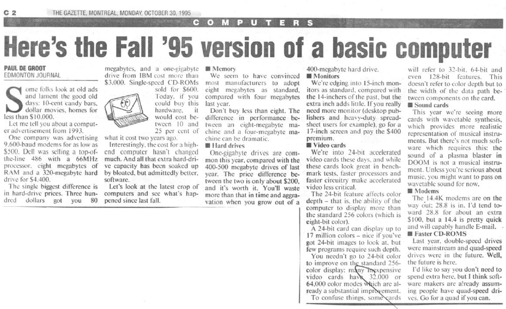
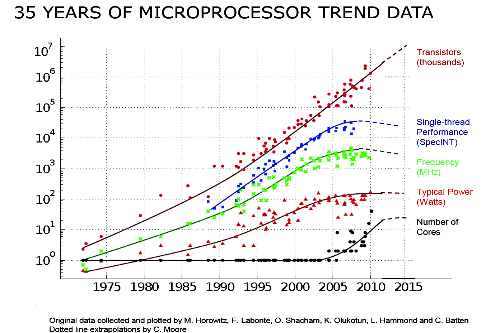
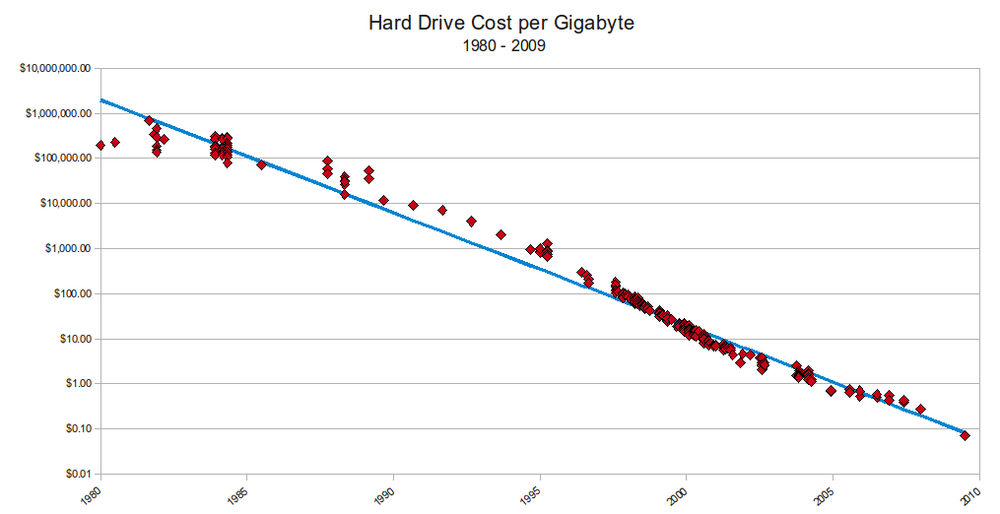
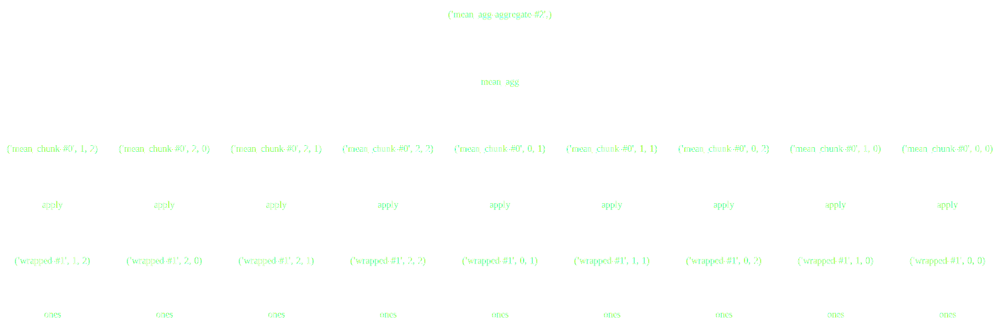
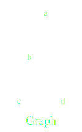
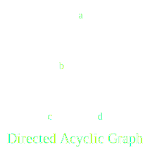
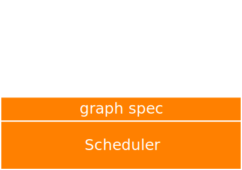

## Dask: Flexible Parallelism


Jim Crist

Continuum Analytics

<hr width=40%>

*Harvard CS207, 11/30/16*

~~~

Materials can be found on github [here](https://github.com/jcrist/talks/tree/master/harvard_cs207_talk)

~===~

### In the beginning...

- Scientific Python goes back to 1995, with Numeric



~~~

### Moore's Law

The number of transistors in a chip ~doubles every two years.

~~~

### Moore's Law



~~~

### Hard drives are getting cheaper



~~~

### As are large workstations

[Amazon EC2 Pricing](http://www.ec2instances.info/)

~===~

### Python has a fast and pragmatic data science ecosystem

---

### ... restricted to a single core :(

~~~

### Most Python programs


~~~

### The SciPy ecosystem

*  **NumPy**: arrays
*  **Pandas**: tables
*  **Scikit Learn**: machine learning
*  **Statsmodels**: statistics
*  ...
*  ...
*  **GeoPandas**: geo-spatial
*  **Scikit-Image**: image analysis
*  **Scikit-Bio**: ...

~~~

### How do we exploit these improvements

---

### ... without rewriting everything?

~===~


### a flexible library for parallelism

~===~

## Dask is:

- A parallel computing framework

- Written in pure Python

- That leverages the excellent Python ecosystem

- Using blocked algorithms and task scheduling

~~~

### Blocked Algorithms

**Blocked Mean**

```python
x = h5py.File('data.hdf5')['x']    # Trillion element array on disk

sums = []
counts = []
N = 1000000
for i in range(N):                  # One million times
    chunk = x[N*i: N*(i+1)]         # Pull out chunk
    sums.append(np.sum(chunk))      # Sum chunk
    counts.append(len(chunk))       # Count chunk

result = sum(sums) / sum(counts)    # Aggregate results
```

~~~

### Blocked Algorithms



~~~

### Task Graphs

- Represent inter-dependent computations as a *graph*
    * Specifically a *Directed Acyclic Graph* (DAG)

~~~

### Task Graphs



~~~

### Task Graphs


~~~

### Task Graphs




~~~

### Task Graphs

- Nodes are *tasks* in the graph
    * Rectangles represent data
    * Circles represent computation

- Edges are data dependencies


~~~

### Task Graphs

- DAGs have a *topological ordering*
    * Can be arranged such that for every edge `a->b`,  `a` comes before `b` in the ordering.


- Not necessarily unique
    * ``a, b, c, d`` 
    * ``a, b, d, c``


~~~

### Task Scheduling

- Scheduler takes in graphs and runs the specified tasks, often in parallel

- Task schedulers are common (Make, MapReduce, Spark, Airflow, etc...)


~~~

### Task Scheduling

- Scheduler takes in graphs and runs the specified tasks, often in parallel

- Task schedulers are common (Make, MapReduce, Spark, Airflow, etc...)


~===~

### Dask Stack



~~~

### Dask Stack


~~~

### Dask Stack


~~~

### Dask Stack


~~~

### Dask Stack


~===~

### Dask Array

- Parallel and out-of-core array library
- Mirrors NumPy interface
- Coordinate many NumPy arrays into single logical Dask array


~~~

### Example

~===~

### Dask Dataframe

- Parallel and out-of-core dataframe library
- Mirrors the Pandas interface
- Coordinates many Pandas DataFrames into single logical Dask DataFrame
- Index is (optionally) sorted, allowing for optimizations


~~~

### Example

~===~

### Dask Bag

- Parallel collection of python objects
- Builds off `toolz`/`cytoolz`

```python
>>> import dask.bag as db
>>> import json

>>> records = db.read_text('path/to/data.*.json.gz').map(json.loads)

>>> records.filter(...).pluck('name').frequencies().topk(10, ...)
```

~===~

## Some problems don't fit well into collections

~~~

### Dask Delayed

- Tool for creating arbitrary task graphs
- Dead simple interface (one function)
- Plays well with existing code (with some caveats)


```python
# Wrap functions to make them lazy
delayed(function)(*args, **kwargs) -> Delayed

# Wrap data to make attribute access lazy
delayed(data) -> Delayed
```

~~~

### Dask Delayed

```python
_
```

---

```python
results = {}

for a in A:
    for b in B:
        results[a, b] = fit(a, b)

best = score(results)
_
```

~~~

### Dask Delayed

```python
from dask import delayed, compute
```

---

```python
results = {}

for a in A:
    for b in B:
        results[a, b] = delayed(fit)(a, b)

best = delayed(score)(results)
result = best.compute()
```

~===~

### Collections author task graphs

<hr>


<hr>

### Now we need to run them efficiently

~~~

### Dask schedulers target different architectures

---

### Easy swapping enables scaling up *and down*

~===~

### Single Machine Scheduler

- *Parallel CPU*: Uses multiple threads or processes

- *Minimizes RAM*: Choose tasks to remove intermediates

- *Low overhead:* ~100us per task

- *Concise*: ~600 LOC, stable for ~12 months

~===~

### Distributed Scheduler

- *Distributed*: One scheduler coordinates many workers

- *Data local*: Tries to moves computation to "best" worker

- *Asynchronous*: Continuous non-blocking conversation

- *Multi-user*: Several users can share the same system

- *HDFS Aware*: Works well with HDFS, S3, YARN, etc..

- *Less Concise*: ~3000 LOC Tornado TCP application

~~~

## Example

~~~

### Distributed Scheduler


~~~

### Task Scheduling


    x = f(1)
    y = f(2)
    z = g(x, y)


~~~

### All decisions are done in-the-small (almost)


### All decisions are done in constant time (almost)

~~~

### Which function to run first?


~~~

### Prefer Tasks on Critical Path


~~~

### Which function to run first?


~~~

### Expose Parallelism


~~~

### Which function to run first?


~~~

### Release Data


~~~

### Release Data, free Memory


~~~

### Two Workers


~~~

### Two Workers


~~~

### Two Workers


~~~

### Two Workers


~~~

### Two Workers


~~~

### Data Locality


~~~

### Data Locality


~~~

### Data Locality


~~~

### .


~~~

### Minimize Communication


~~~

### Balance Computation and Communication


~~~

### .


~~~

### Work Steal


~~~

### Work Steal


~~~

### Other Optimizations ...

- Gracefully scale up or down based on load
- Optionally compress messages based on small samples
- Oversubscribe workers with many small tasks
- Batch many-small-messages in 2ms windows
- Spill unused data to disk

~===~


## Dask is...

- *Familiar:* Implements NumPy/Pandas interfaces
- *Flexible:* for sophisticated and messy algorithms
- *Fast:* Optimized for demanding applications
- *Scales up:* Runs resiliently on clusters
- *Scales down:* Pragmatic on a laptop
- *Responsive:* for interactive computing

---

Dask *complements* the Python ecosystem.

~~~

### Easy to get started

conda/pip installable

```bash
$ conda install dask distributed -c conda-forge
$ pip install dask[complete] distributed --upgrade
```

---

```python
>>> from dask.distributed import Executor
>>> e = Executor()  # sets up local cluster
```

---

```bash
$ dask-scheduler

$ dask-worker scheduler-hostname:8786
$ dask-worker scheduler-hostname:8786
```

~~~

### Acknowledgements

- Countless [open source developers](https://github.com/dask/dask/graphs/contributors)
- SciPy developer community
- Continuum Analytics
- DARPA XData Program
- Moore Foundation

---

### Questions?


~===~

## Extras...

~~~

### Q: How does Dask differ from Spark?

- Spark is great
    - ETL + Database operations
    - SQL-like streaming
    - Spark 2.0 is decently fast
    - Integrate with Java infrastructure
- Dask is great
    - Tight integration with NumPy, Pandas, Toolz, Sklearn, ...
    - Ad-hoc parallelism for custom algorithms
    - Easy deployment on clusters or laptops
    - Complement the existing SciPy ecosystem (Dask is lean)
- Both are great
    - Similar network designs and scalability limits
    - Decent Python APIs

~~~

### Q: How is dask used in practice?

- Large arrays for climate and atmospheric science (HDF5 data)
- Single machine lightweight PySpark clone for logs and JSON
- Dataframes on piles of CSV data
- Custom applications

---

- Roughly equal mix of academic/research and corporate
