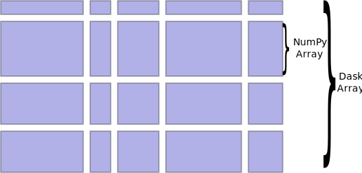
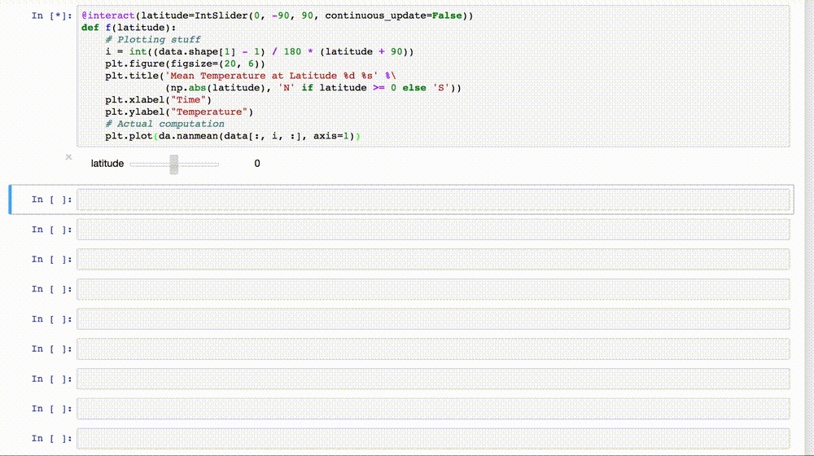
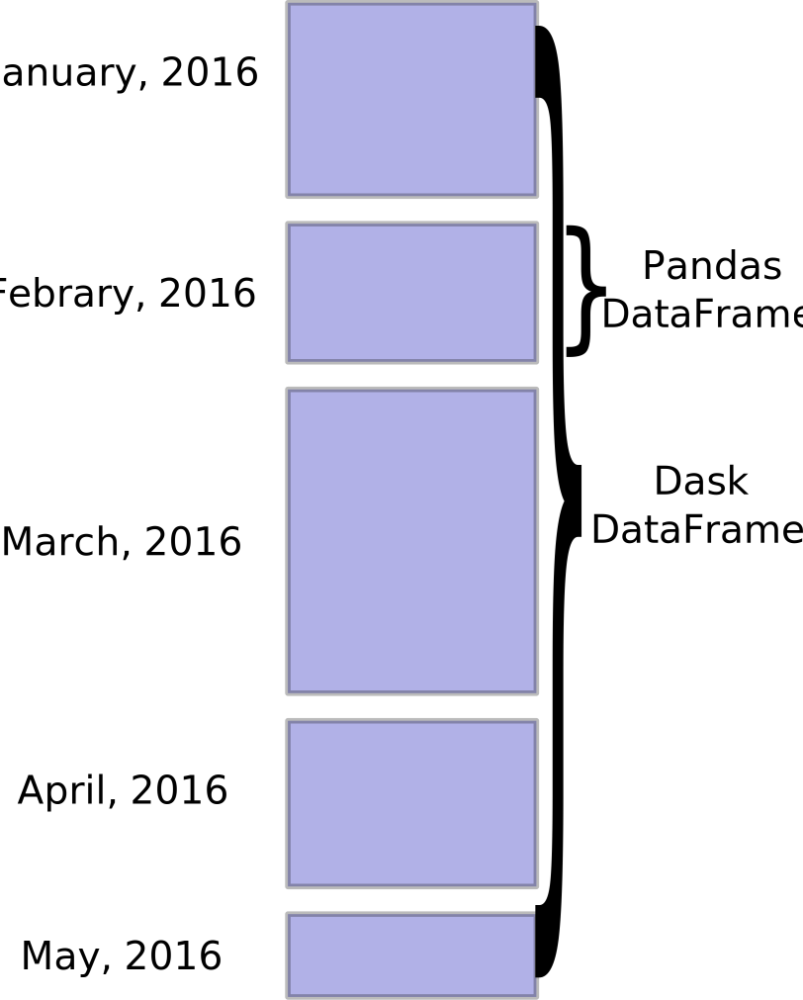
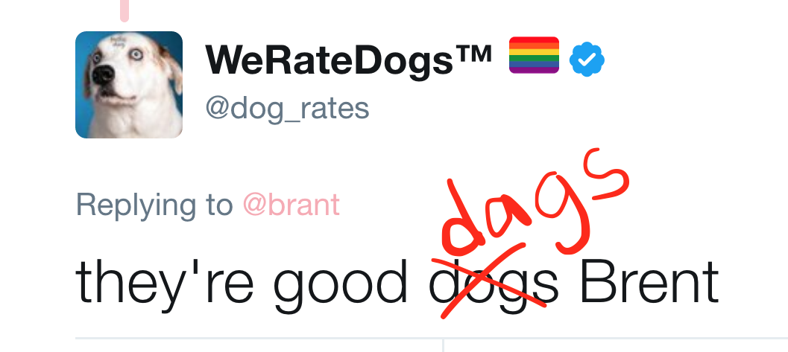
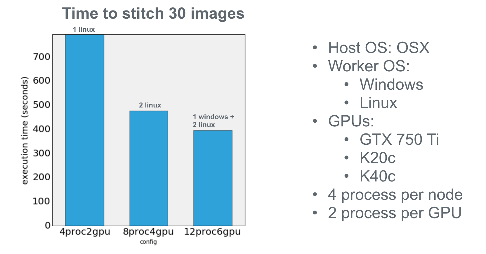
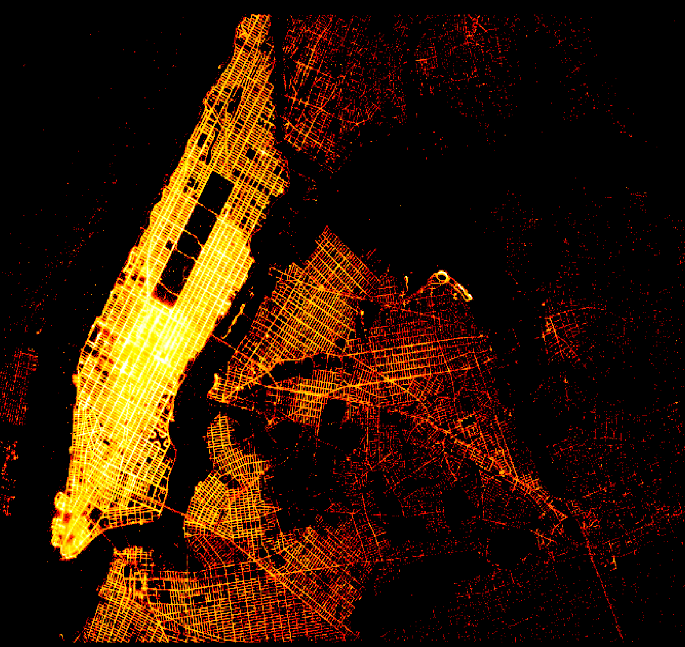
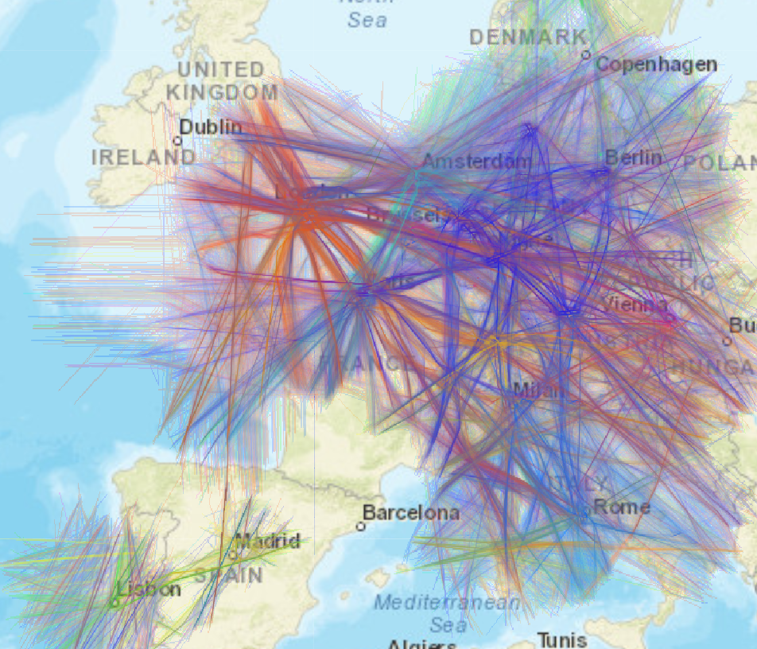
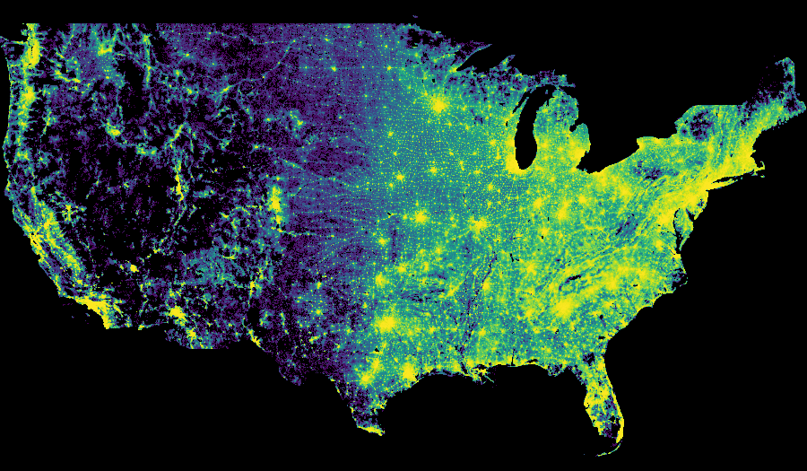
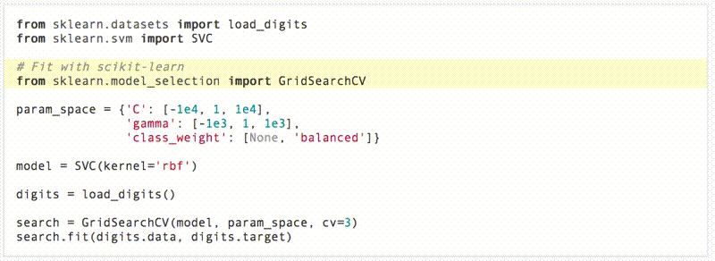

## New Developments in Scaling Python Analytics


Jim Crist

Continuum Analytics

<hr width=40%>

*Big Data Tech, 6/7/2017*

~===~

### In the beginning...


Scientific Python goes back to 1995 with `numeric`

---

Many wrapped libraries are even older (e.g. MINPACK)

~~~

### Large, pragmatic scientific ecosystem

*  **NumPy**: arrays
*  **Pandas**: tables
*  **Scikit Learn**: machine learning
*  **Statsmodels**: statistics
*  ...
*  ...
*  **GeoPandas**: geo-spatial
*  **Scikit-Image**: image analysis
*  **Scikit-Bio**: biology
*  ...

~~~

### Python is fast

- Ease of use -> Fast development time
- (Most) operations call down to fast C/Fortran code

~~~

### Python is slow

- Interpretted -> loopy code can be slow
- Poor parallelism support

~~~

### Most Python Programs


~~~

### Solutions?

**Scale Up**                        |  **Scale Out**
------------------------------------|-------------------
- C, C++, Fortran, Cython, ...      | - MPI
- CUDA-C, OpenCL                    | - Spark, MapReduce, ...

~~~

### Can I improve performance without...

- Switching languages?
- Requiring a full rewrite?
- Installing large infrastructure?
- Increasing complexity?

~===~

### Enter Dask & Numba


~===~

# Dask


### a flexible library for parallelism

~~~

## Dask is:

- A parallel computing framework

- Written in pure Python

- That leverages the excellent Python ecosystem

- Using blocked algorithms and task scheduling

~~~

### Blocked Algorithms

**Blocked Mean**

```python
x = h5py.File('data.hdf5')['x']     # Trillion element array on disk

sums = []
counts = []
N = 1000000
for i in range(N):                  # One million times
    chunk = x[N*i: N*(i+1)]         # Pull out chunk
    sums.append(np.sum(chunk))      # Sum chunk
    counts.append(len(chunk))       # Count chunk

result = sum(sums) / sum(counts)    # Aggregate results
```

~~~

### Blocked Algorithms

```python
x.mean()
```


~~~

```python
x + x.T
```


~~~
```python
x.dot(x.T + 1)
```


~~~
```python
x.dot(x.T + 1) - x.mean()
```


~~~
```python
(x.dot(x.T + 1) - x.mean()).std()
```


~~~
```python
U, S, V = da.linalg.svd(x + x.T - x.mean())
```


~===~

### Dask Array

- Parallel and out-of-core array library
- Mirrors NumPy interface
- Coordinate many NumPy arrays into single logical Dask array



~~~

### Example: Ocean Temperature Data

- 36 Years worth of Ocean Temperature Data (52 GB)
- http://www.esrl.noaa.gov/psd/data/gridded/data.noaa.oisst.v2.html

~~~

Using a cluster of 4 `m4.xlarge` workers (16 cores)



~===~

### Dask Dataframe

- Parallel and out-of-core dataframe library
- Mirrors the Pandas interface
- Coordinates many Pandas DataFrames into single logical Dask DataFrame
- Index is (optionally) sorted, allowing for optimizations



~~~

### Mirrors Pandas API

```python
# Reductions
df.passenger_count.mean()

# Groupby operations
df.groupby(df.passenger_count).trip_distance.mean()

# Timeseries operations
df.trip_distance.resample('h').mean()

# many many more...
```

~===~

## Some problems don't fit well into collections

~~~

### Dask Delayed

- Tool for creating arbitrary task graphs
- Dead simple interface (one function)
- Plays well with existing code (with some caveats)


```python
# Wrap functions to make them lazy
delayed(function)(*args, **kwargs) -> Delayed

# Wrap data to make attribute access lazy
delayed(data) -> Delayed
```

~~~

### Dask Delayed

```python
_
```

---

```python
results = {}

for a in A:
    for b in B:
        for c in C:
            r1 = fit1(x, a)
            r2 = fit2(r1, b)
            r3 = fit3(r2, c)
            results[a, b, c] = r3
best = score(results)
_
```

~~~

### Dask Delayed

```python
from dask import delayed, compute
```

---

```python
results = {}

for a in A:
    for b in B:
        for c in C:
            r1 = delayed(fit1)(x, a)
            r2 = delayed(fit2)(r1, b)
            r3 = delayed(fit3)(r2, c)
            results[a, b, c] = r3
best = delayed(score)(results)
result = best.compute()
```

~~~

### Dask Delayed


~===~

### It's all about DAGs


~~~

### It's all about DAGs




~===~

### Collections author task graphs

<hr>


<hr>

### Now we need to run them efficiently

~~~

### Single Machine Scheduler

- *Parallel CPU*: Uses multiple threads or processes

- *Minimizes RAM*: Choose tasks to remove intermediates

- *Low overhead:* ~100us per task

- *Concise*: ~600 LOC, stable for ~12 months

~~~

### Distributed Scheduler

- *Distributed*: One scheduler coordinates many workers

- *Data local*: Tries to moves computation to "best" worker

- *Asynchronous*: Continuous non-blocking conversation

- *Multi-user*: Several users can share the same system

- *HDFS Aware*: Works well with HDFS, S3, YARN, etc..

- *Less Concise*: ~3000 LOC Tornado TCP application

~===~

# Numba


### a jit compiler for Python

~~~

## Numba

- A type-specializing method JIT for (numeric) Python

- Translate Python syntax to machine code

- Code generation done with:
    - LLVM (for CPU)
    - NVVM (for CUDA GPUs)

~~~

### Example

Sum all positive elements in an array:

```python
import numba as nb

@nb.jit
def sum_positive(x):
    out = 0
    for element in x:
        if element > 0:
            out += element
    return out
```

~~~

### Example

```python
In [1]: import numpy as np

In [2]: from numba_example import sum_positive

In [3]: x = np.random.uniform(-1, 1, 100000)

In [4]: %timeit sum_positive(x)
10000 loops, best of 3: 107 µs per loop

In [5]: %timeit x[x > 0].sum()
1000 loops, best of 3: 563 µs per loop
```

**5.5x speedup!**

~===~

## Examples

~===~

### Image Registration & Stitching

- Computationally expensive
- Numba compiled phase correlation
- GPU FFT
- Run remotely and distributed
- More info in [Scipy 2016 talk](https://youtu.be/jLQ2wAwapRg)


~~~

### Image Registration & Stitching




~===~

### Datashader

- A small library for interactive plotting of large datasets
- Uses numba and dask for performance
- http://datashader.readthedocs.io/





~===~

### Dask-SearchCV

- Distributed Hyperparameter Optimization
- Drop-in replacement for Scikit-Learn `GridSearchCV`
- http://dask-searchcv.readthedocs.io/



~===~

### Growing Dask Ecosystem

- [`dask-glm`](https://github.com/dask/dask-glm): Distributed Generalized Linear Models
- [`dask-xgboost`](https://github.com/dask/dask-xgboost): Use XGBoost with dask
- [`dask-tensorflow`](https://github.com/dask/dask-tensorflow): Use tensorflow with dask
- Tools for deployment:
    - [`dask-ec2`](https://github.com/dask/dask-ec2)
    - [`dask-kubernetes`](https://github.com/martindurant/dask-kubernetes)
    - [`dask-yarn`](https://github.com/dask/dask-yarn)
    - [`dask-drmaa`](https://github.com/dask/dask-drmaa)
    - [`dask-marathon`](https://github.com/mrocklin/dask-marathon)
- Many more...

~===~

## Summary

~~~

## Dask is...

- *Familiar:* Implements NumPy/Pandas interfaces
- *Flexible:* for sophisticated and messy algorithms
- *Fast:* Optimized for demanding applications
- *Scales up:* Runs resiliently on clusters
- *Scales down:* Pragmatic on a laptop
- *Responsive:* for interactive computing

~~~

### Numba is...

- *Familiar:* Compiles ordinary python functions
- *Flexible:* Not restricted to broadcasting operations
- *Fast:* Compiles to run on CPU or GPU
- *Accessible:* No need to learn another language to achieve performance

~~~

### Easy to get started

conda/pip installable

```bash
$ conda install dask distributed -c conda-forge
$ pip install dask[complete] distributed --upgrade

$ conda install numba
```

~~~

### Easy to get started

```python
>>> from dask.distributed import Client
>>> e = Client()  # sets up local cluster
```

---

```bash
$ dask-scheduler

$ dask-worker scheduler-hostname:8786
$ dask-worker scheduler-hostname:8786
```

~~~

### Acknowledgements

- Countless open source developers
- SciPy developer community
- Gordon & Betty Moore Foundation
- DARPA XData Program
- Continuum Analytics

---

### Questions?


~===~

## Extras...

~~~

### Q: How does Dask differ from Spark?

- Spark is great
    - ETL + Database operations
    - SQL-like streaming
    - Spark 2.0 is decently fast
    - Integrate with Java infrastructure
- Dask is great
    - Tight integration with NumPy, Pandas, Toolz, Sklearn, ...
    - Ad-hoc parallelism for custom algorithms
    - Easy deployment on clusters or laptops
    - Complement the existing SciPy ecosystem (Dask is lean)

~~~

### Q: How is dask used in practice?

- Large arrays for climate and atmospheric science (HDF5 data)
- Single machine lightweight PySpark clone for logs and JSON
- Dataframes on piles of CSV data
- Custom applications

---

- Roughly equal mix of academic/research and corporate
