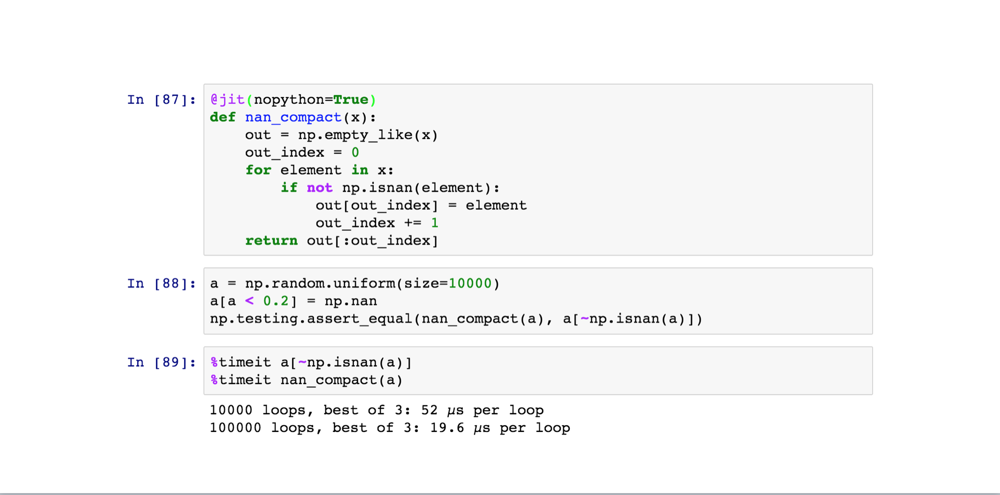
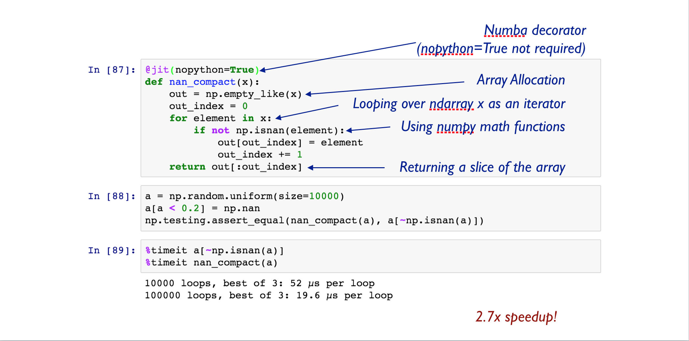

## Scaling Numerical Python with
## Dask & Numba


Jim Crist

Continuum Analytics

<hr width=40%>

*OSBD Workshop, 12/05/16*

~===~

### In the beginning...

Scientific Python goes back to 1995

- Numpy (2005, roots back to 1995)
- Scipy (2000, roots back to 1998, wrapped code even older)
- IPython (2001)
- Matplotlib (2002)
- Cython (2007, roots back to 2002)
- Pandas (2009)

~~~

### Large, pragmatic scientific ecosystem

*  **NumPy**: arrays
*  **Pandas**: tables
*  **Scikit Learn**: machine learning
*  **Statsmodels**: statistics
*  ...
*  ...
*  **GeoPandas**: geo-spatial
*  **Scikit-Image**: image analysis
*  **Scikit-Bio**: ...

~~~

### Python is fast

- Ease of use -> Fast development time
- (Most) operations call down to fast C/Fortran code

~~~

### Python is slow

- Interpretted -> loopy code can be slow
- Poor parallelism support

~~~

### Most Python Programs


~~~

### Solutions?

**Scale Up**                        |  **Scale Out**
------------------------------------|-------------------
- C, C++, Fortran, Cython, ...      | - MPI
- CUDA-C, OpenCL                    | - Spark, MapReduce, ...

~~~

### Can I improve performance without...

- Switching languages?
- Requiring a full rewrite?
- Installing large infrastructure?
- Increasing complexity?

~===~

### Dask & Numba


~===~

# Dask


### a flexible library for parallelism

~~~

## Dask is:

- A parallel computing framework

- Written in pure Python

- That leverages the excellent Python ecosystem

- Using blocked algorithms and task scheduling

~~~

### Blocked Algorithms

**Blocked Mean**

```python
x = h5py.File('data.hdf5')['x']    # Trillion element array on disk

sums = []
counts = []
N = 1000000
for i in range(N):                  # One million times
    chunk = x[N*i: N*(i+1)]         # Pull out chunk
    sums.append(np.sum(chunk))      # Sum chunk
    counts.append(len(chunk))       # Count chunk

result = sum(sums) / sum(counts)    # Aggregate results
```

~~~

### Blocked Algorithms

```python
x.mean()
```


~~~

```python
x + x.T
```


~~~
```python
x.dot(x.T + 1)
```


~~~
```python
x.dot(x.T + 1) - x.mean()
```


~~~
```python
(x.dot(x.T + 1) - x.mean()).std()
```


~~~
```python
U, S, V = da.linalg.svd(x + x.T - x.mean())
```


~===~

### Dask Stack


~~~

### Dask Stack


~~~

### Dask Stack


~~~

### Dask Stack


~~~

### Dask Stack


~===~

### Dask Array

- Parallel and out-of-core array library
- Mirrors NumPy interface
- Coordinate many NumPy arrays into single logical Dask array


~~~

### Example

~~~

### Example


~===~

### Dask Dataframe

- Parallel and out-of-core dataframe library
- Mirrors the Pandas interface
- Coordinates many Pandas DataFrames into single logical Dask DataFrame
- Index is (optionally) sorted, allowing for optimizations


~~~

### Supports **most** of the Pandas api

```python
# Reductions
df.passenger_count.mean()

# Groupby operations
df.groupby(df.passenger_count).trip_distance.mean()

# Timeseries operations
df.trip_distance.resample('h').mean()

# many many more...
```

~===~

## Some problems don't fit well into collections

~~~

### Dask Delayed

- Tool for creating arbitrary task graphs
- Dead simple interface (one function)
- Plays well with existing code (with some caveats)


```python
# Wrap functions to make them lazy
delayed(function)(*args, **kwargs) -> Delayed

# Wrap data to make attribute access lazy
delayed(data) -> Delayed
```

~~~

### Dask Delayed

```python
_
```

---

```python
results = {}

for a in A:
    for b in B:
        for c in C:
            r1 = fit1(x, a)
            r2 = fit2(r1, b)
            r3 = fit3(r2, c)
            results[a, b, c] = r3
best = score(results)
_
```

~~~

### Dask Delayed

```python
from dask import delayed, compute
```

---

```python
results = {}

for a in A:
    for b in B:
        for c in C:
            r1 = delayed(fit1)(x, a)
            r2 = delayed(fit2)(r1, b)
            r3 = delayed(fit3)(r2, c)
            results[a, b, c] = r3
best = delayed(score)(results)
result = best.compute()
```

~~~

### Dask Delayed


~===~

### Collections author task graphs

<hr>


<hr>

### Now we need to run them efficiently

~~~

### Dask schedulers target different architectures

---

### Easy swapping enables scaling up *and down*

~===~

### Single Machine Scheduler

- *Parallel CPU*: Uses multiple threads or processes

- *Minimizes RAM*: Choose tasks to remove intermediates

- *Low overhead:* ~100us per task

- *Concise*: ~600 LOC, stable for ~12 months

~===~

### Distributed Scheduler

- *Distributed*: One scheduler coordinates many workers

- *Data local*: Tries to moves computation to "best" worker

- *Asynchronous*: Continuous non-blocking conversation

- *Multi-user*: Several users can share the same system

- *HDFS Aware*: Works well with HDFS, S3, YARN, etc..

- *Less Concise*: ~3000 LOC Tornado TCP application

~~~

### Optimizations

- Data-locality aware -> move functions to data
- Work steal to utilize idle workers
- Gracefully scale up or down based on load
- Optionally compress messages based on small samples
- Oversubscribe workers with many small tasks
- Batch many-small-messages in 2ms windows
- Spill unused data to disk

~===~

### Numba

- A type-specializing JIT for (numeric) Python

- Translate Python syntax to machine code

- Code generation done with:
    - LLVM (for CPU)
    - NVVM (for CUDA GPUs)

~~~

### Example



~~~

### Example



~===~

### Example: Image Registration & Stitching

- Computationally expensive
- Numba compiled phase correlation
- GPU FFT
- Run remotely and distributed
- More info in [Scipy 2016 talk](https://youtu.be/jLQ2wAwapRg)


~~~

### Image Registration


~===~

## Dask is...

- *Familiar:* Implements NumPy/Pandas interfaces
- *Flexible:* for sophisticated and messy algorithms
- *Fast:* Optimized for demanding applications
- *Scales up:* Runs resiliently on clusters
- *Scales down:* Pragmatic on a laptop
- *Responsive:* for interactive computing

~~~

### Numba is...

- *Familiar:* Compiles ordinary python functions
- *Flexible:* Not restricted to broadcasting operations
- *Fast:* Compiles to run on CPU or GPU
- *Accessible:* No need to learn another language to achieve performance

~~~

### Easy to get started

conda/pip installable

```bash
$ conda install dask distributed -c conda-forge
$ pip install dask[complete] distributed --upgrade

$ conda install numba
```

~~~

### Easy to get started

```python
>>> from dask.distributed import Client
>>> e = Client()  # sets up local cluster
```

---

```bash
$ dask-scheduler

$ dask-worker scheduler-hostname:8786
$ dask-worker scheduler-hostname:8786
```

~~~

### Acknowledgements

- Countless open source developers
- SciPy developer community
- Continuum Analytics
- DARPA XData Program
- Moore Foundation

---

### Questions?


~===~

## Extras...

~~~

### Q: How does Dask differ from Spark?

- Spark is great
    - ETL + Database operations
    - SQL-like streaming
    - Spark 2.0 is decently fast
    - Integrate with Java infrastructure
- Dask is great
    - Tight integration with NumPy, Pandas, Toolz, Sklearn, ...
    - Ad-hoc parallelism for custom algorithms
    - Easy deployment on clusters or laptops
    - Complement the existing SciPy ecosystem (Dask is lean)
- Both are great
    - Similar network designs and scalability limits
    - Decent Python APIs

~~~

### Q: How is dask used in practice?

- Large arrays for climate and atmospheric science (HDF5 data)
- Single machine lightweight PySpark clone for logs and JSON
- Dataframes on piles of CSV data
- Custom applications

---

- Roughly equal mix of academic/research and corporate
