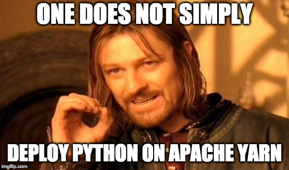
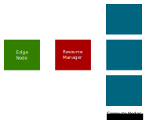
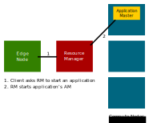
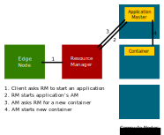
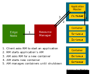

# Skein 

---

#### Deploy Python on your Hadoop Cluster, easily

<br>

*Jim Crist / [@jiminy_crist](https://twitter.com/jiminy_crist) / [jcrist](https://github.com/jcrist)*

~===~

## "Hadoop Clusters"

- Take many forms
    - Enterprise distributions (Cloudera, Hortonworks, MapR, etc...)
    - Cloud deployments (Amazon EMR, Google DataProc, etc...)
    - Custom installations

- A collection of nodes managed by Apache YARN

~~~

## What is Apache YARN?

- "Yet Another Resource Negotiator"

- Manages memory and CPU usage across the cluster

- Ensures resources are being shared across teams

~~~

## What is Apache YARN?

YARN is a common deployment environment for data science/engineering tools

- Spark
- Flink
- Hadoop
- Hive
- Impala
- ...

~===~

## The Problem

---

I work on a similar tool ([Dask](https://dask.org/))

It would be nice to be able to deploy Dask on YARN

~~~

## The Problem

---

More generally, it would be nice to deploy *any* Python application on YARN.

~~~

## tl;dr

It works!

~~~

But how did we get here?

~===~

## Issues deploying Python on YARN

~~~



~~~

## Issues deploying Python on YARN

- YARN is written in Java, Java only tooling

- Hadoop security is *[complicated](https://steveloughran.gitbooks.io/kerberos_and_hadoop/)*

- File distribution is harder, can't just pip/conda install

- Not all clusters are the same
    - YARN configurations are numerous
    - Common for old versions to be deployed

~~~

# :(

~===~

## Introducing Skein

---

## Simpler YARN deployments

~===~

## Hello World

```yaml
name: hello-world
queue: default

services:
  hello:
    resources:
      memory: 128 MiB
      vcores: 1
    commands:
      - echo "hello world"
```

~~~

## Hello World

```yaml
name: hello-world
queue: default

services:
  hello:
    resources:
      memory: 128 MiB
      vcores: 1
    commands:
      - echo "hello world"
```

```bash
$ skein application submit hello_world.yaml
```

~===~

## YARN Architecture (simplified)



~~~

## YARN Architecture (simplified)


~~~

## YARN Architecture (simplified)



~~~

## YARN Architecture (simplified)


~~~

## YARN Architecture (simplified)



~~~

## YARN Architecture (simplified)



~===~

## Skein Features

- A declarative, language independent specification

- CLI and Native Python API
    - Easy to add other languages (gRPC spec)

- Application Master and Client provided

- An internal key-value store for coordinating applications

- An extensible Web UI for tracking and interacting with applications

~===~

## Running a Python script

```yaml
name: myapp
queue: default

services:
  myapp:
    resources:
      memory: 128 MiB
      vcores: 1
    files:
      script.py: script.py
    commands:
      - python script.py
```

~~~

## Distributing Dependencies

- No need if all dependencies are already on every node

- [`conda-pack`](https://conda.github.io/conda-pack/): Package conda environments

- [`venv-pack`](https://jcrist.github.io/venv-pack/): Package virtual environments

- More information: https://jcrist.github.io/skein/distributing-files.html

~~~

## Running a Python script with dependencies

```yaml
name: csv2parquet
queue: default

services:
  myapp:
    resources:
      memory: 128 MiB
      vcores: 1
    env:
      ARROW_LIBHDFS_DIR: /opt/cloudera/parcels/CDH-5.15.1-1.cdh5.15.1.p0.4/lib64/
    files:
      environment: environment.tar.gz
      csv2parquet.py: csv2parquet.py
    commands:
      - source environment/bin/activate
      - python csv2parquet.py
```

~~~

### Aside: these tools also work with PySpark/Sparklyr

https://conda.github.io/conda-pack/spark.html

```
$ conda pack -o environment.tar.gz
Collecting packages...
Packing environment at '/Users/jcrist/anaconda/envs/example' to 'environment.tar.gz'
[########################################] | 100% Completed | 23.2s
```

```
$ PYSPARK_PYTHON=./environment/bin/python \
spark-submit \
--conf spark.yarn.appMasterEnv.PYSPARK_PYTHON=./environment/bin/python \
--master yarn \
--deploy-mode cluster \
--archives environment.tar.gz#environment \
script.py
```

~===~

## Additional Features

~~~

## Coordinating containers with the key-value store

- Mainly for sharing dynamic configuration (e.g. ports)
- Inspired by [etcd](https://github.com/etcd-io/etcd) (with modifications)
- Supports:
    - Atomic transactions
    - Key and range operations
    - Subscriptions
    - Ownership Model
- Can be used to build larger concurrency abstractions

~~~

## Extensible Web UI

- YARN supports application Web UI's
- Only support GET operations due to reasons :(
- Skein provides a builtin Web UI
- Users can extend this Web UI to support their application

~~~

## Example: [Bokeh Dashboard](https://github.com/jcrist/skein/tree/master/examples/pricing_dashboard)

~===~

## Testing YARN Applications

- *"If you don’t test your YARN application in a secure Hadoop cluster, it
  won’t work."* - [YARN
  docs](https://hadoop.apache.org/docs/stable/hadoop-yarn/hadoop-yarn-site/YarnApplicationSecurity.html)

- Easier said than done - cluster deployment is insider knowledge

- Non-trivial to set one up on CI

~~~

## [`hadoop-test-cluster`](https://github.com/jcrist/hadoop-test-cluster)

- A CLI tool for spinning up realistic test clusters
- Supports `simple` and `kerberos` authentication
- Runs fine locally or on Travis CI
- Designed to be extensible

~~~

## [`hadoop-test-cluster`](https://github.com/jcrist/hadoop-test-cluster)

```bash
$ pip install hadoop-test-cluster
```

```bash
$ htcluster startup
$ htcluster login
```

~===~

## Putting it all together
## [`dask-yarn`](http://yarn.dask.org)

~~~

## [`dask-yarn`](http://yarn.dask.org)

- Install like any other Python library

- Can deploy Dask on any Hadoop Cluster

- Create clusters programatically, or using the CLI (`dask-yarn submit ...`)

~~~

## [`dask-yarn`](http://yarn.dask.org)

```python
from dask_yarn import YarnCluster
from dask.distributed import Client

# Create a cluster where each worker has 2 cores and 4 GiB of RAM
cluster = YarnCluster(environment='environment.tar.gz',
                      worker_vcores=2,
                      worker_memory="4GiB")

# Scale out to four such workers
cluster.scale(4)

# Connect to the cluster
client = Client(cluster)
```

~===~

## Ongoing and Future Work

- [Tensorflow on YARN](https://github.com/criteo/tf-yarn) (from Criteo)

- [Ray on YARN](https://github.com/ray-project/ray/issues/2214)

- Deployment option on [Jupyter Enterprise Gateway](https://jupyter-enterprise-gateway.readthedocs.io)

- Expand and improve Dask support (adaptive scheduling, proxy out dashboard)

~===~

## Review

- [`skein`](https://jcrist.github.io/skein/): Schedule and manage yarn
  applications

- [`conda-pack`](https://conda.github.io/conda-pack/) &
  [`venv-pack`](https://jcrist.github.io/venv-pack/): Package Python
  environments for redistribution

- [`hadoop-test-cluster`](https://github.com/jcrist/hadoop-test-cluster): Test
  your code against a realistic hadoop cluster

- [`dask-yarn`](http://dask-yarn.readthedocs.io/): Run dask on YARN

~~~

### Do you use the Hadoop ecosystem?

### Could this be useful for you?

---

### I'd love to get in contact:

- Twitter: [@jiminy_crist](https://twitter.com/jiminy_crist)

- Github: [jcrist](https://github.com/jcrist)

~===~

## Extras

---

(for if these questions are asked)

~===~

## But YARN uses protobuf, couldn't you write your own client?

Sure, but...

- Not all clusters are the same

- Uses a custom RPC protocol

- Hadoop security is *[complicated](https://steveloughran.gitbooks.io/kerberos_and_hadoop/)*

~~~

## But YARN has a REST API, couldn't you use that?

For some things maybe, but...

- They aren't open in all clusters

- They may be secured by secondary tools (e.g. KNOX), opens larger set of
  configuration issues

- Not all operations are supported

- The submit API is impossible to use without a Java HDFS client (no other way
  to get ms timestamps)
